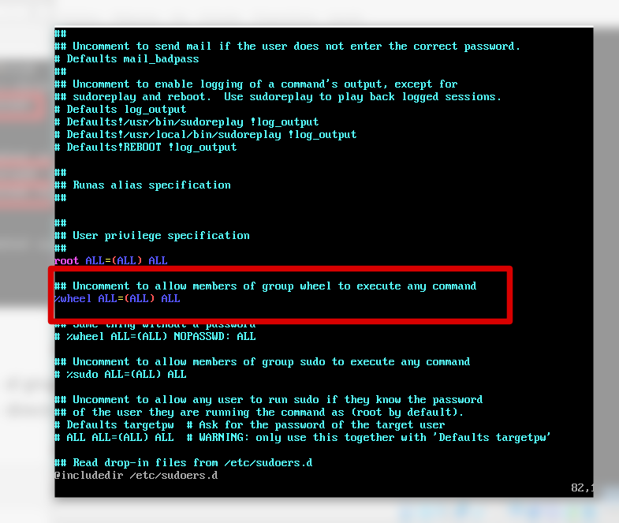

# Instalación de archLinux


A simple, lightweight distribution

## Introducción

Arch Linux puede ejecutarse en cualquier máquina compatible x86\_64 con al menos 530 MB de RAM. Una instalación básica debería ocupar menos de 2 GiB de espacio en disco.

La descarga está disponible desde la página oficial en [https://www.archlinux.org/download/](https://www.archlinux.org/download/). Creamos una máquina y agregamos la imagen de instalación.

En el primer arranque nos encontramos con el boot system y seleccionamos la instalación en una arquitectura de 64 bits.


Lo primero que hacemos es modificar la distribución del teclado con el siguiente comando:

```bash
loadkeys es
```


Vamos a utilizar la máquina ArchLinux como cliente ligero de nuestros entornos de laboratorio y vamos a conectarnos a ella de manera remota mediante SSH.

### Conexión remota mediante SSH

La ISO de instalación nos permite conectarnos remotamente para realizar todos los pasoso. Para poder utilizar una conexión SSH desde mi sistema anfitrión necesito establecer una contraseña al usuario root y crear un usuario local de la ISO de instalación.

#### Creación de usuario de instalación

Con el comando passwd creamos la contraseña para root.

```bash
passwd
```

A continuación, creamos un usuario \(con el parámetro -m para que cree su directorio correspondiente\) y le agregamos contraseña.

```text
useradd -m tux
passwd tux
```


#### Iniciar servicio SSH

A continuación, iniciamos el servicio de ssh

```bash
systemctl start sshd
```

Si ejecutamos ss para mostrar los puertos a la escucha veremos que esta el puerto 22 disponible para conexiones tcp entrantes.

```bash
ss -ntl
```


#### Conectarse a Internet

Para configurar una conexión de red nos aseguramos de que nuestra máquina tenga acceso a Internet. Podemos establecer modo puente.

Nos aseguramos de que nuestra interfaz está lista y activada con el comando:

```bash
ip link
```

Comprobamos la IP

```bash
ip a
```

Verificamos que tenemos conexión a Internet.

```bash
ping -c 3 www.cuatrovientos.org
```


#### Conexión desde Sistema anfitrión

Ahora podemos realizar la conexión desde nuestra máquina anfitriona a la máquina Arch Linux para dar continuidad al proceso de instalación.

```bash
ssh tux@192.168.1.40
```

Podemos hacer uso del comando su – para pasar a ser root.

```bash
su -
```


## Instalación

Vamos a comenzar con la instalación. No tenemos asistente por lo que tendremos que hacer todo por nuestra cuenta. Lo primero que vamos a hacer es mostrar los _block devices._ Como vemos tenemos una unidad sda

```bash
lsblk
```

### Crear particiones

Vamos a crear las particiones a la unidad con un simple menú a través del editor de particiones cfdisk

```bash
cfdisk /dev/sda
```


Creamos una nueva partición DOS y vamos a establecer un espacio de 256M para swapping.


Establecemos esta partición como primaria y a continuación vamos a modificar el tipo a un Linux Swap


En el resto del espacio creamos una partición de tipo Linux haciendo uso del resto del espacio. Seleccionamos la opción Write y confirmamos que queremos guardar estos cambios.


Una vez que hemos creado nuestras particiones podemos terminar el asistente.

### Formatear particiones

Vamos a crear el sistema de archivos para swaping con el comando mkswap, dando formato a la primera de las particiones que hemos creado dentro de la unidad /dev/sda

```bash
mkswap /dev/sda1
```

A continuación, formateamos nuestro sistema de archivos real con el siguiente comando.

```bash
mkfs.xfs /dev/sda2
```

el cual será nuestro sistema de archivos raíz.


Ahora lo que tenemos que hacer es habilitar esas dos particiones para poder utilizarlas. Tenemos que permitir hacer swapping en /dev/sda1 y montar /dev/sda2 en el directorio /mnt

```bash
swapon /dev/sda1
```

```bash
mount /dev/sda2 /mnt
```


## Añadiendo paquetes

Continuando con la instalación, ahora vamos a agregar los paquetes. Vamos a utilizar el paquete pactrap para instalar el paquete base y base-devel un grupo de paquetes que incluye las herramientas necesarias para la creación \(compilación y vinculación\).

También podemos agregar el bootloader grub, un potente editor vim, el completador de scripts de bash y el servidor de open ssh.


```
pacstrap /mnt base base-devel linux linux-firmware grub vim bash-completion openssh networkmanager
```

### Fstab

Lo siguiente que haremos es crear el archivo [fstab ](https://wiki.archlinux.org/index.php/Fstab_%28Espa%C3%B1ol%29)para que el sistema monte estos sistemas de archivos en el arranque. Utilizamos los archivos de tipo sudo que haya y utilizamos U para hacer referencia a las UUID de los sistemas de archivos.

|  | UUID es un mecanismo para dotar a cada sistema de archivos de un identificador único. |
| :--- | :--- |


 Queremos leer lo que se encuentre en el directorio /mnt y escribirlo en la ruta completa donde se ubica el archivo fstab.

```bash
genfstab -pU /mnt >> /mnt/etc/fstab
```

### Chroot

En este punto ya podemos cambiar la raíz al nuevo sistema. Ahora todos los comandos ejecutados hacer referencia a la ubicación que hemos montado.

```bash
arch-chroot /mnt
```

Ahora volvemos a establecer la contraseña para el usuario root y generamos nuestro usuario local, pero esta vez el usuario se esta creando en el sistema operativo real. Agregamos el usuario a un grupo _wheel_ el cual puede ser utilizado para administración.

```bash
passwd
useradd -m tux -G wheel
passwd tux
```


Para agregar a nuestro usuario al grupo de sudo tenemos que editar el archivo sudoers, pero este archivo no se edita directamente, sino que se hacer a través del comando visudo.

```bash
visudo
```

Descomentamos la línea correspondiente al grupo wheel para hacer que los miembros de este grupo puedan ejecutar cualquier comando.



### Zona horaria

Definimos nuestra zona horaria

```bash
ln -sf /usr/share/zoneinfo/Europe/Brussels /etc/localtime
```

### Idioma del sistema

Vamos a establecer las configuraciones de idioma, para ello editamos /etc/local.gen y descomentamos la línea de idioma que nos interese.

```bash
vim /etc/locale.gen
```

Ejecutamos el siguiente comando para generar el contenido en el idioma correspondiente.

```bash
locale-gen
```

### Initramfs

Vamos a asegurarnos de que tenemos el Bootloader Grub y nuestro disco de RAM creado ejecutando el siguiente comando y le establecemos la configuración para un kernel de Linux.

```bash
mkinitcpio -p linux
```


### Grub

A continuación instalamos el cargador Grub

```bash
grub-install /dev/sda
```

Queremos que la configuración de grub se almacene en un archivo en nuestro sistema

```bash
grub-mkconfig -o /boot/grub/grub.cfg
```


## Reiniciar

Queremos asegurarnos de que nuestro servicio para obtener IP y SSH estan en ejecución

```bash
systemctl enable dhcpd sshd
```

Para reiniciar necesitamos salir de nuestro entorno chroot y reiniciamos

```bash
exit
```

```bash
shutdown -r now
```

## Post instalación

Una vez reiniciado el sistema podemos optar por establecerle un nombre a nuestra máquina para hacerla reconocible y diferenciar una de otra. Recordad que vamos a usar estos sistemas como clientes de nuestros laboratorios.

#### Configuración de nombre, idioma y teclado

```bash
hostnamectl set-hostname ****
```


Establecemos la distribución del teclado.

```bash
localectl set-keymap es
```

Podemos comprobar esto con el siguiente comando

```bash
cat /etc/vconsole.conf
```


Una vez comprobado también podemos actualizar el idioma con localectl

```bash
localectl set-locale LANG=en_GB.UTF
```

Lo podemos comprobar con

```bash
cat /etc/locale.conf
```


### Configuración de red

Para establecer una configuración de red estática podemos editar el archivo de dhcpd.conf

```bash
vim /etc/dhcpd.conf
```

Nos dirigimos al final del archivo con Go para establecer nuestra configuración.


Reiniciamos la máquina y comprobamos nuestra dirección IP.

## Conclusión

Con esta guía hemos visto que la instalación de la distribución de Arch Linux es bastante compleja, comparándola con otras distribuciones de Linux. Pero nos ha servido para revisar ciertos conceptos y comprender mejor el proceso de instalación de un sistema operativo.

Arch Linux nos ofrece una distribución ligera y personalizable adecuada para usarla como cliente en varios de nuestros entornos de laboratorio.

|  | Ahora es tu turno. Realiza un videotutorial donde se vean los pasos a seguir para realizar la instalación de ArchLinux. |
| :--- | :--- |


## Bibliografía

Arch Linux \(2020\) _Guía de Instalación._ Recuperado de: [https://wiki.archlinux.org/index.php/Installation\_guide\_\(Espa%C3%B1ol\)](https://wiki.archlinux.org/index.php/Installation_guide_%28Espa%C3%B1ol%29)

